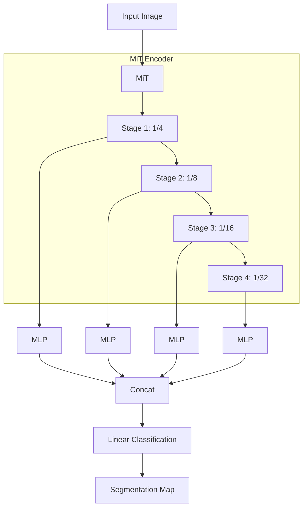
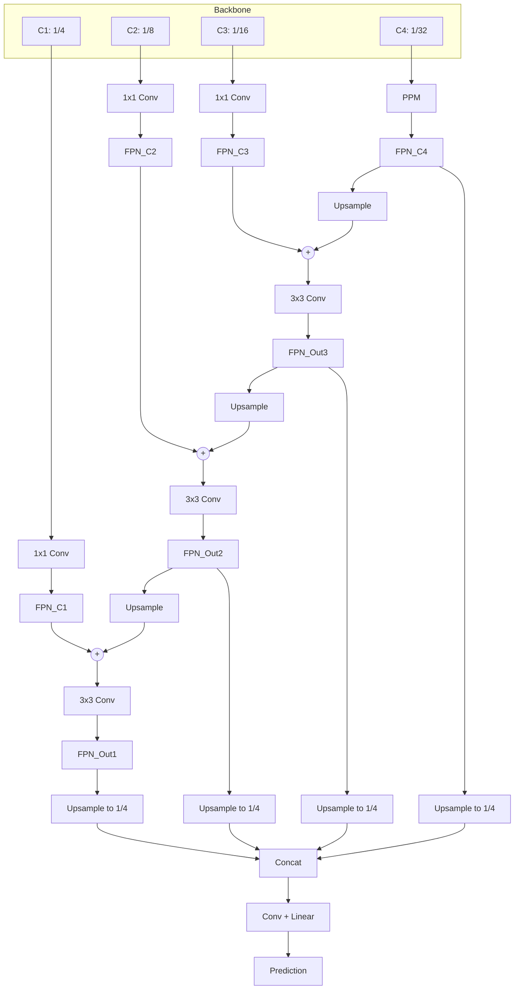
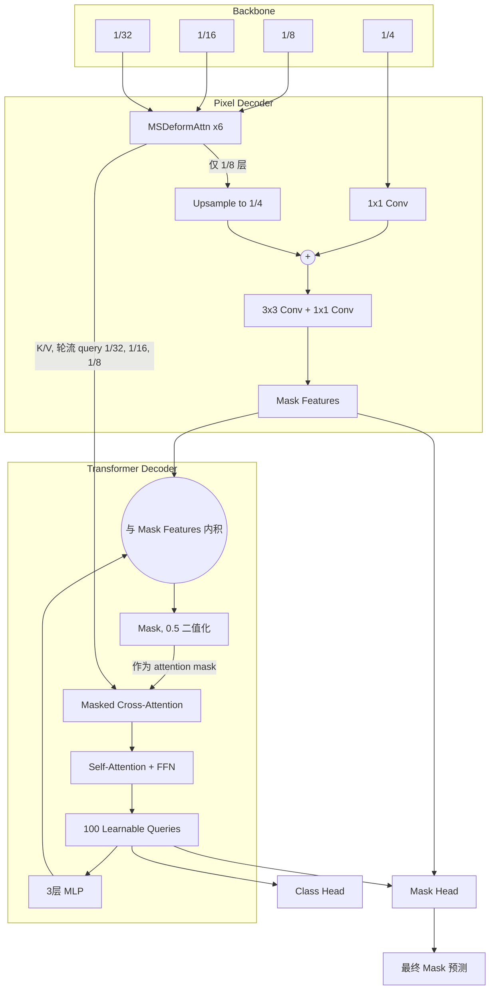

+++  
date = '2026-10-06T18:20:26+08:00'  
draft = true  
title = '语义分割的模型和方案'  
+++

语义分割（Semantic Segmentation）是计算机视觉中的一种图像理解任务：将图像中的每一个像素分配到一个预定义的类别标签，从而实现对图像按语义区域进行像素级划分。其中有一些较强可尝试的模型和方案，可以在对应场景需要时尝试。

## SegFormer

`SegFormer`是一种较为轻量的语义分割模型，他的思路是将传统的`CNN`分割网络的倒金字塔结构保留，然后引入注意力，这主要是靠`MiT`实现的。`MiT`靠`Overlap Patch Embedding`实现倒金字塔的降分辨率操作，然后使用`MiT Transformer Layer`进行注意力和`FFN`，他对注意力和`FFN`进行了修改，使用`Efficient Self-Attention`和`Mix-FFN`。其中`Efficient Self-Attention`就是将`KV`进行了降采样，使用带步长的卷积核堆叠，将`KV`的`Token`数下降到较低水平，来降低注意力开销。然后是`Mix-FFN`，他在第一个`Linear`后加了`3x3 Depthwise Convolution`来进行局部空间信息交互。一方面这个`DWConv`在这里提供了局部空间信息交互，另一方面他还提供了一定的`Patch`空间信息。在`SegFormer`里面，他还去掉了`Attention`的位置编码，因为`ViT`中一般使用的位置编码是绝对位置编码，他不利于扩展输入图片大小，所以他去掉了，而这里的`DWConv`就补了一定空间信息。

`SegFormer`的`Encoder`一般是有四层`Layer`，分别下采样到`1/4`、`1/8`、`1/16`、`1/32`。而且其中为了降低注意力的开销的步长卷积堆叠数也会依次降低，因为在`Layer`中已经进行了下采样，具体为`8`、`4`、`2`、`1`个`Conv`。`SegFormer`的`Decoder`十分简单，因为`Encoder`的各个`Layer`输出会导致特征的`channel`数不断增大，他的`Decoder`第一步就是统一各个`Layer`输出的`channel`，然后他再统一将各个`Layer`输出的尺寸`upsample`到`1/4`，然后`concat`之后完全展平，最后直接一个`Linear`映射到`class`维进行分类。他的特点就是轻量，因此在`Benchmark`上分数并不是很高，适合做快速实验以及做`Baseline`。

## UPerNet

`UPerNet`是一种多尺度语义分割`Decoder`/`Head`。因此他不是一种具体模型，但是他可以用来作为进阶`Decoder`使用，接在各种`Backbone`后。

`UPerNet`接受像`SegFormer`那样的分层特征。在最高层特征上，他会进行`PPM`（`Pyramid Pooling Module`），使用不同核大小的`Mean Pool`，例如：

- `1x1`
- `2x2`
- `3x3`
- `6x6`

然后获取对应`Pool`结果之后再`upsample`回高层特征的`size`，然后直接将这些与原始的最高层特征`concat`，然后用卷积融合进去或者一个与初始的最高层特征的`shape`相同的特征。`PPM`能给最高级语义特征增加不同尺度的全局`Context`。

然后就是`FPN`。对于上面的最高层语义特征进行`PPM`获得的产物和其他层的特征，我们对他们分别进行一次`channel`统一，然后依次将最高层特征与更低一层的特征`upsample`的结果进行相加，然后用`3x3 Conv`融合获得新的融合特征，然后让这个新的融合特征与下一层特征相加然后融合，获得各层的融合特征，最后将它们相连之后再进行一次卷积融合，然后用一个`Linear`层将最后一维映射到`class`维上。

相比于`SegFormer`的这种简单的`Decoder`，`UPerNet`很适合用来作为下一步，测试`Decoder`是否是瓶颈项来提升分数。

## Mask2Former

`Mask2Former`也是一种分割`Decoder`，他统一了语义分割、实例分割、全景分割。它由`Backbone Encoder`，`Pixel Decoder`还有`Transformer Decoder`。他对`Encoder`的要求与上面的其他的分割头一样，要求输出多层特征，典型层次还是`1/4`、`1/8`、`1/16`、`1/32`，然后这些分层特征会先经过`Pixel Decoder`。

其中`1/8`、`1/16`、`1/32`会进入到一个分支，`1/4`进入另一个分支。对于前三个，他们进行`1x1 Conv`将`channel`统一到`256`之后加入`2D Position Embedding`和`Learnable Level Embedding`然后将他们展平都作为`Token`，然后进入`6`层`MSDeformAttn`（`Multi-Scale Deformable Attention`）。这里并非`Transformer`式的`Attn`，而是一种独特的方式来降低消耗。对于每个`Query Token`，他对每个注意力`Head`，每个`Level`，采样`4`个`Token`进行注意力计算，因此需要 $\mathrm{Head} \times \mathrm{Level} \times 4 \times 2$ 个位置信息，他通过一个`Linear`，将每个`Token`的`256`映射出对应需要的维度，这里的`2`指的是他的`2D`位置信息。当位置信息非标准`Token`位置的时候，他并非舍入，而是用附近的`Token`双线性插值来解决，同时在这套操作中他给每个`Token`的`2D`位置都加了`0.5`，来表示每个`Patch`的中心位置。获取了这些`Sample Offsets`之后，他还要获取对于每个`Token`的`Attention Weights`，同样通过`Linear`映射出来。然后进行注意力计算。

$$
z_q^m = \sum_{l=1}^{L} \sum_{k=1}^{K} A_{mlqk} F_l (p_q + \Delta p_{mlqk})
$$

其中 $\Delta p_{mlqk}$ 正是`Sample Offsets`，而 $A_{mlqk}$ 就是进行了`Softmax`保证权重总和为`1`，这里的 $F_l$ 正是双线性插值。他的最后输出就是通过`Split`将`Level`和`Size`维度恢复回来的特征，这些`Level`和`Size`信息在他一开始`Flatten`之前就存储了。

然后其中`1/4`的分支，也先用`1x1 Conv`，让他的`channel`变成`256`，然后将上面的这里的`MSDeformAttn`输出的`1/8`特征上采样到`1/4`，然后与上层特征相加，然后用`3x3 Conv`结合，然后再经过一个`1x1 Conv`保证输出的`channel`为`256`，最后就获得了`Mask Feature`。

然后是`Transformer Decoder`，他有`100`个可学习的`Query Feature`和`100`个可学习的`Query Embedding`，第一层对`Query Feature`进行`LayerNorm`之后通过一个三层`MLP`得到每个`Query`的`256`维嵌入，然后与`Pixel Decoder`的`Mask Feature`进行内积获得`100`个`Query`各自的`Mask`，然后按照这一层要`Query`的层次特征进行`Mask` `Bilinear Interpolation` `Resize`到对应`Size`，然后以`0.5`为阈值进行`Mask`构建。然后他就开始计算`Mask Attention`，原本说的`Query Embedding`就会加在`Q`上，`K`就是层次特征加上位置信息，`V`就是层次特征，并且加上上面的`Mask`，然后再接上标准`Attention`和`FFN`，然后就到了下一层。经过上一层信息交互的`Query Feature`再次构建`Mask`，只不过这次的要`Query`的层次特征变成了更底层的那一个，即`1/32`、`1/16`、`1/8`这样每层被`Query`。然后他的`Class Head`就是取每层后的`Query Feature`进行预测，对每个`Query`预测一个`Class`，并用`3`层`MLP`预测对应的`Mask`。再加上一般他会让第一层之前还没做交互的`Query Feature`进行一次预测，也就是 `Layer+1` 次预测，一般是`10`次，也就是`9`层，意味着这些层次特征一般会被`Query` `3`次。最后取真的预测`Mask`的时候，他只用最后一层的预测。在推理阶段，对于每个像素，将每个`Query`预测的类别概率与其对应的`Mask`概率相乘，得到每个类别在该像素上的得分，然后将所有`Query`对同一类别的贡献求和，最后取得分最大的类别作为该像素的最终预测。

`Mask2Former`的分割效果一般强于`UPerNet`，通过和较强的`Backbone`组合，他能达到分割的`SOTA`水平，例如与`DINOv2`和他的`Adapter`结合，即使冻结`DINO`，也能达到`SOTA`，或者与`Swin Transformer`等等结合等，也能获得很好的效果。

